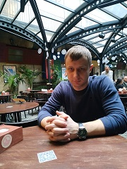

## [rsschool-cv](https://github.com/Kostya-x-pro/rsschool-cv/)

# **Voronkov KostyA** 

***

### **About me:** 
Hello, I'm a beginner front-end developer. I graduated from BRU and work as an engineer. But over time, I realized that I was doing something completely different from what I would like to do in life, that's how I got to my first front-end courses and now RS. My strengths are flexibility, mobility, communication and stress resistance. I quickly find a common language and interests in the team. I want to gain knowledge for further development and employment. 
***

### **Skils:**
* _Windows OS_
* _Markdown_
* _HTML_
* _CSS_
* _Java Script_
* _Git_ 
* _Photoshop_
***

### **My contacts:**
 * _Mail: kostya-voronkov1992@rambler.ru_ 
 * _Discord: Kostya1992#6219_
 * _Instagam: kvoronkoff777_
 * _Github: https://github.com/Kostya-x-pro_
 * _Adress: Belarus/Mogilev_
 * _Skype: live:2a42d7cae279dbbb_ 
***

### **Code examples:**
    function multCustomer(a, b) {
     let count = 1;
     for (let i = 1; i <= b; i++) {
        count *= a;
      }
      return count;
    }
    console.log(multCustomer(2, 4));
***

### **Languages**
* _Belorusian_
* _Russian_
* _English_

